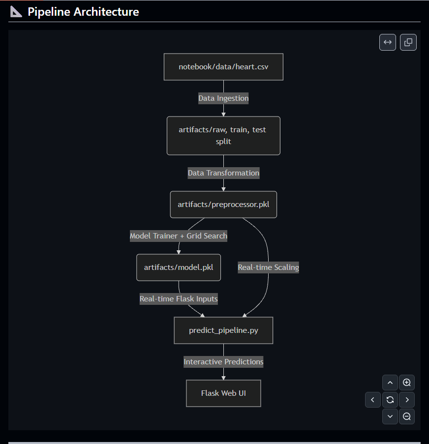

# Heart Disease Prediction System (Modular ML Pipeline)

A production-grade machine learning project designed with a modular codebase architecture. It automates the entire ML lifecycle including data ingestion, data preprocessing/transformation, model training with hyperparameter tuning, and real-time inference served through a responsive Flask web application.

---

##  Features

- **Modular Codebase Architecture:** Follows industry-standard practices, separating components for Ingestion, Transformation, Training, and Prediction.
- **Robust Preprocessing Pipeline:** Handled automatically via `ColumnTransformer` (incorporating `SimpleImputer` for handling missing values and `StandardScaler` for normalization).
- **Hyperparameter Optimization:** Utilizes `GridSearchCV` inside a custom evaluation helper to optimize the Logistic Regression classifier.
- **Interactive Web Interface:** A sleek, responsive user interface built using modern CSS, Google Fonts (Inter & Outfit), subtle animations, and clear validation messages.
- **Easy Package Deployment:** Includes `setup.py` to package the codebase, making it pip-installable (`pip install -e .`).

---

##  Pipeline Architecture




---

## 📂 Project Structure

```text
├── artifacts/                      # Outputs generated during pipeline runs (model and splits)
│   ├── data.csv                    # Raw dataset copy
│   ├── train.csv                   # Training split (80%)
│   ├── test.csv                    # Testing split (20%)
│   ├── preprocessor.pkl            # Preprocessing & scaling pipeline object
│   └── model.pkl                   # Best trained model object
│
├── notebook/                       # Jupyter research and EDA datasets
│   └── data/
│       └── heart.csv               # Original heart disease dataset
│
├── src/                            # Core application source code
│   ├── components/                 # ML pipeline components
│   │   ├── __init__.py
│   │   ├── data_ingestion.py       # Reads raw data, creates artifacts, splits train/test
│   │   ├── data_transformation.py  # Cleans, imputes, and scales features
│   │   └── model_trainer.py        # Optimizes, trains, and saves the machine learning model
│   │
│   ├── pipeline/                   # Run-time pipelines
│   │   ├── __init__.py
│   │   └── predict_pipeline.py     # Maps UI input fields to DataFrame, loads scaler/model, predicts
│   │
│   ├── __init__.py
│   └── utils.py                    # Reusable helper functions (save/load picklers, model evaluator)
│
├── templates/                      # Flask UI pages
│   ├── index.html                  # Basic welcome landing page
│   └── home.html                   # Main interactive prediction form dashboard
│
├── app.py                          # Flask web server entrypoint
├── requirements.txt                # List of Python library dependencies
├── setup.py                        # Python setuptools packaging script
└── README.md                       # Comprehensive documentation (this file)
```

---

## Clinical Parameters & Input Details

The prediction model relies on the following 13 clinical inputs to determine the risk score:

1. **Age:** Age of the patient (years).
2. **Sex:** Gender of the patient (`0` = Female, `1` = Male).
3. **Chest Pain Type (cp):** Type of chest pain (`0` = Typical Angina, `1` = Atypical Angina, `2` = Non-anginal pain, `3` = Asymptomatic).
4. **Resting Blood Pressure (trestbps):** Resting blood pressure in mm Hg on admission to the hospital.
5. **Serum Cholesterol (chol):** Serum cholesterol in mg/dl.
6. **Fasting Blood Sugar > 120 mg/dl (fbs):** Fasting blood sugar levels (`0` = False, `1` = True).
7. **Resting ECG Results (restecg):** Resting electrocardiographic results (`0` = Normal, `1` = ST-T wave abnormality, `2` = Showing probable or definite left ventricular hypertrophy).
8. **Maximum Heart Rate Achieved (thalach):** Maximum heart rate achieved during stress test.
9. **Exercise Induced Angina (exang):** Angina symptoms induced by exercise (`0` = No, `1` = Yes).
10. **Oldpeak:** ST depression induced by exercise relative to rest.
11. **Slope:** The slope of the peak exercise ST segment (`0` = Upsloping, `1` = Flat, `2` = Downsloping).
12. **Number of Major Vessels (ca):** Number of major vessels (0-4) colored by fluoroscopy.
13. **Thalassemia (thal):** Thalassemia classification (`1` = Normal, `2` = Fixed defect, `3` = Reversible defect, `0` = Unknown / Other).

---

## 🛠️ Local Setup and Execution Guide

Follow these steps to set up and run the modular machine learning pipeline locally on your machine:

### 1. Prerequisites
Ensure you have Python 3.8+ installed.

### 2. Set Up a Virtual Environment
Navigate to the project directory and create a Python virtual environment:

```bash
# Create virtual environment
python -m venv .venv

# Activate the virtual environment
# On Windows (PowerShell):
.venv\Scripts\Activate.ps1
# On Windows (Command Prompt):
.venv\Scripts\activate.bat
# On macOS/Linux:
source .venv/bin/activate
```

### 3. Install Requirements and Package the Project
Install project dependencies and set up the local package structure:
```bash
pip install -r requirements.txt
pip install -e .
```

### 4. Train the Model Pipeline
To execute the data ingestion, feature transformation, and model training pipelines:
```bash
python src/components/data_ingestion.py
```
This script will:
1. Load the original dataset from `notebook/data/heart.csv`.
2. Split it into training and test datasets under the `artifacts/` folder.
3. Apply standard scaling and imputation, saving the transformation object to `artifacts/preprocessor.pkl`.
4. Train a Logistic Regression model (with Grid Search cross-validation) and save it to `artifacts/model.pkl`.

### 5. Launch the Web Application
Run the Flask server:
```bash
python app.py
```
Open your browser and navigate to `http://localhost:5000/predictdata` to start making heart disease risk predictions using the interactive UI form!

---
